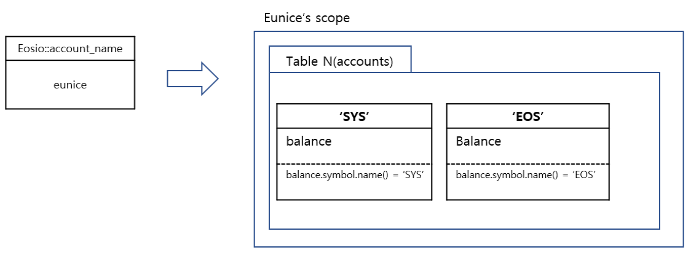
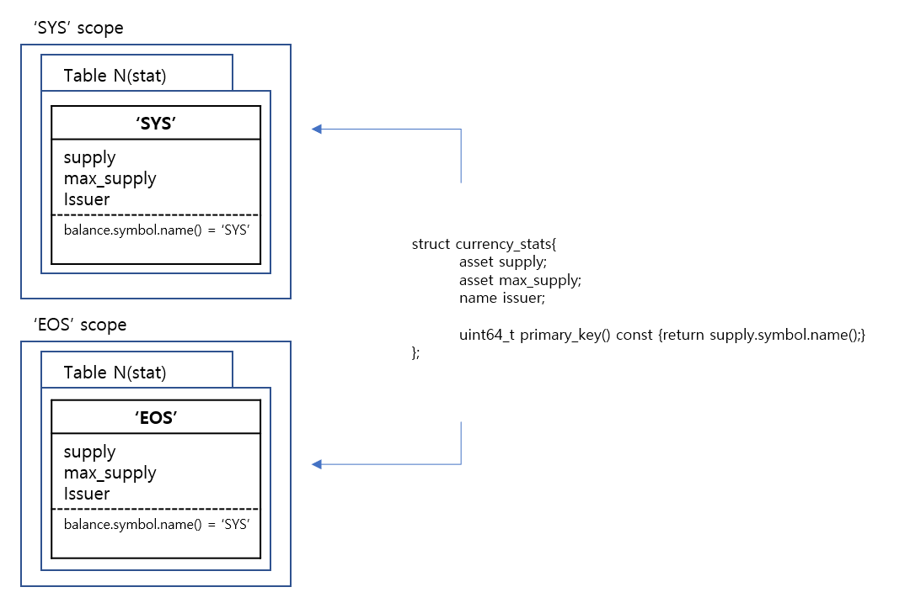

## table
### account
다음은 잔고를 갖는 account라는 구조체에 대한 정의이다.
```c++
struct [[eosio::table]] account {
            asset    balance;

            uint64_t primary_key()const { return balance.symbol.code().raw(); }
         };
```
`multi_index<테이블명, 테이블화 할 구조체명> 구조체 `로 하여금 accounts 테이블을 생성한다. multi_index에 대한 자세한 내용은 설명을 생략한다.

```c++
typedef eosio::multi_index< "accounts"_n, account > accounts;
```
위 내용을 객체화 하면 다음과 같다.


### currency_stats
다음은 currency_stats구조체에 대한 정의이다.
```c++
         struct [[eosio::table]] currency_stats {
            asset    supply; //발행량
            asset    max_supply; //최대 발행량
            name     issuer; // 발행자

            uint64_t primary_key()const { return supply.symbol.code().raw(); }
         };
```
`multi_index<테이블명, 테이블화 할 구조체명> 구조체 `로 하여금 stats 테이블을 생성한다. multi_index에 대한 자세한 내용은 설명을 생략한다. 

```c++
         typedef eosio::multi_index< "stat"_n, currency_stats > stats;
```
위 내용을 객체화 한다면 다음과 같다.

