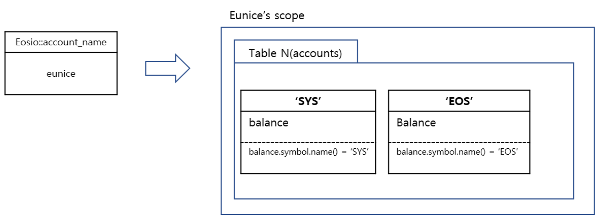
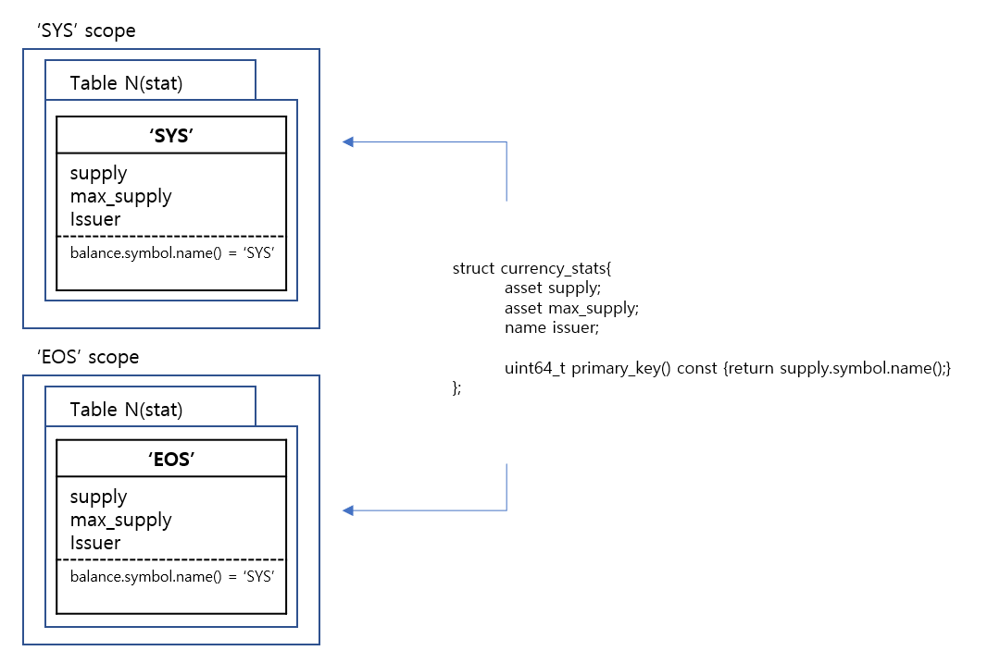

# [eosio.token](https://github.com/EOSIO/eosio.contracts/tree/master/eosio.token)에 대한 정밀 분석 part1

## 도입
eos는 지금도 빠르게 다양한 문제들을 흡수하고 새로운 도구들을 개발하며 확장시켜나가고 있습니다. 이에 대한 흐름을 라인분석을 통해 전반적으로 캐치업하려했던 개인적인 학습 내용들을 포함하고 있습니다.

## contract 전개 및 사전 설명

```c++
   class [[eosio::contract("eosio.token")]] token : public contract {
```
이오스 토큰 클래스는 기본적으로 contract 를 상속하고 있습니다. 클래스 내부는 생성자와 action을 담고 있는 `public`, table 내용과 도움함수 (helper function)의 내용을 포함하는`private`로 나뉩니다.

소스코드를 보면 `[[eosio::action]]` , `[[eosio::table]]`, `[[eosio::contract("eosio.token")]]` 등과 같은 키워드를 쉽게 찾아볼 수 있습니다. `[[eosio::action]]`을 예로 들었을 때 **eosio.cdt**의 **ABI 생성기**는 각 함수가 action임을 알지 못합니다. 따라서 해당 키워드를 통해 action임을 명시해 ABI가 인식할 수 있도록 합니다.

## action
> implace, modify를 포함한 기타 contract 외의 함수는 아래쪽에서 설명한다.

### create
```c++
void token::create( name   issuer,
                    asset  maximum_supply )
{
    require_auth( _self );
```
create는 토큰을 생성하는 action입니다. 매개변수로`issuer`와 `maximum_supply`를 받고 있습니다. `issuer`는 유일하게 토큰공급을 늘릴 수 있는 사람이며 `maximum_supply`는 데이터 공급량의 최대치를 의미합니다. #1에서는 `require_auth( _self );`를 통해 컨트랙트 실행권한이 user와 동일한지 비교합니다. 나중에 커맨드 라인에서 `-p eosio token` 작업시 플래그로 지정이 가능합니다. 
```c++
    auto sym = maximum_supply.symbol;
    eosio_assert( sym.is_valid(), "invalid symbol name" );
    eosio_assert( maximum_supply.is_valid(), "invalid supply");
    eosio_assert( maximum_supply.amount > 0, "max-supply must be positive");
```
symbol 이름과 supply 값이 유효한지, maximum-supply가 실제 양수 값을 갖는지 검사합니다.
```c++
    stats statstable( _self, sym.code().raw() );
    auto existing = statstable.find( sym.code().raw() );
    eosio_assert( existing == statstable.end(), "token with symbol already exists" );
    statstable.emplace( _self, [&]( auto& s ) {
       s.supply.symbol = maximum_supply.symbol;
       s.max_supply    = maximum_supply;
       s.issuer        = issuer;
    });
}
```
// 내용을 테이블에 추가하는 과정을 나타냅니다. `currency_stats` 구조체를 테이블로 갖는 stats형 statstable에 나(`_self`)에 대한 테이블을 불러와 토큰명이 존재하지 않을 때만 `emplace`함수로 데이터를 넣습니다.
 emplace 함수는 매개변수를 두개 받는데,

* `_self`는 램 사용에 대해 지불할 계좌이름 (stake된 저장소 비용을 지불)
* `[&]( auto& s ) {something}`는 람다 함수로 테이블에 생성할 객체를 해당 something의 내용으로 초기화해주는 역할을 합니다.

### issue
 발급된 토큰을 받을 계정, 발행된 토큰의 수량, 메모 이 세 가지 매개변수를 받는 issue 함수는 생성된 토큰을 수정하고 전송하는 action을 취합니다.
```c++
void token::issue( name to, asset quantity, string memo )
{
    auto sym = quantity.symbol;
    eosio_assert( sym.is_valid(), "invalid symbol name" );
    eosio_assert( memo.size() <= 256, "memo has more than 256 bytes" );
```
토큰의 심볼과 메모의 사이즈를 검사합니다.
```c++
    stats statstable( _self, sym.code().raw() );
    auto existing = statstable.find( sym.code().raw() );
    eosio_assert( existing != statstable.end(), "token with symbol does not exist, create token before issue" );
    const auto& st = *existing;
```
(`_self`)가 가진 심볼 이름을 불러와 매개변수로 받은 토큰의 심볼과 비교합니다.
```c++
    require_auth( st.issuer );
    eosio_assert( quantity.is_valid(), "invalid quantity" );
    eosio_assert( quantity.amount > 0, "must issue positive quantity" );

    eosio_assert( quantity.symbol == st.supply.symbol, "symbol precision mismatch" );
    eosio_assert( quantity.amount <= st.max_supply.amount - st.supply.amount, "quantity exceeds available supply");
```
컨트랙트 실행 권한을 비교하고 유효한 값이라면
```c++
    statstable.modify( st, same_payer, [&]( auto& s ) {
       s.supply += quantity;
    });

    add_balance( st.issuer, quantity, st.issuer );
```
statstable 내의`modify`함수를 통해 테이블 내 토큰량을 수정한 후 `add_balance`를 통해 해당 사용자의 토큰을 증가 시킵니다.
```c++
    if( to != st.issuer ) {
      SEND_INLINE_ACTION( *this, transfer, { {st.issuer, "active"_n} },
                          { st.issuer, to, quantity, memo }
      );
    }
}
```
`SEND_INLINE_ACTION` 매소드는 실제 전송하는 작업을 하는데 매개변수로 (작업이 속한 컨트랙트 코드, ACTION이름, 액션에 필요한 권한,액션에 대한 논증)을 매개변수로 받습니다.

> 생각에 실제 소유주가 토큰을 보낼 수 있는 권한을 타인에게 넘겼을 때만 실행되는 부분 같다. (물어봐야지) 

### retire
retire는 토큰 발행량을 줄이는 역할을 하는 함수입니다. 토큰량과 메모를 매개변수로 받습니다. 이하 검증작업에 대해서는 다른 함수와 같으므로 설명을 생략합니다.
```c++
void token::retire( asset quantity, string memo )
{
	...검증부분 생략...
        
    require_auth( st.issuer );
    eosio_assert( quantity.is_valid(), "invalid quantity" );
    eosio_assert( quantity.amount > 0, "must retire positive quantity" );
```
검증을 완료 했다면 토큰에 들어있는 심볼과 테이블 내에 심볼이 같은지 확인합니다.
```c++
eosio_assert( quantity.symbol == st.supply.symbol, "symbol precision mismatch" );
```
심볼이 같다면,  테이블에서 `modify`함수를 이용해 토큰량을 차감 시킵니다.
```c++
    statstable.modify( st, same_payer, [&]( auto& s ) {
       s.supply -= quantity;
    });
```
컨트랙트 내의 balance를 차감 시킵니다.
```c++
    sub_balance( st.issuer, quantity );
}
```
### transfer
```c++
void token::transfer( name    from,
                      name    to,
                      asset   quantity,
                      string  memo )
{
```
transfer 액션은 토큰을 타인에게 보낼 때 사용되는 함수 입니다. 매개변수는 보내는 사람, 받는사람, 보낼 토큰량, 메모로 이루어져있습니다.

```c++
    eosio_assert( from != to, "cannot transfer to self" );
    require_auth( from );
    eosio_assert( is_account( to ), "to account does not exist");
    auto sym = quantity.symbol.code();
    stats statstable( _self, sym.raw() );
    const auto& st = statstable.get( sym.raw() );
```
보내는 사람과 받는사람의 계정이 다른지 확인하고 보내는 사람의 계정이 컨트랙트 실행 권한이 user와 동일한지`require_auth()`,  받는 사람의 계정이 실제 존재하는 계정인지`is_account()`를 확인하고 심볼 코드를 확인해 해당 statstable 에서 해당하는 심볼의 내용들을 가져옵니다.
```c++
    require_recipient( from );
    require_recipient( to );
```
`require_recipient`함수를 통해 from과 to쪽 모두  notification을 보냅니다. 받는 쪽의 컨트랙트에서 이 notification을 받아 처리할 수 있는데, 자세한 내용은 생략하도록 하겠습니다.

> require_recipient 기능을 이용하면  출금 기능을 자동으로 로깅(logging)할 수 있게 됩니다. 컨트랙트에서 출금이 발생했을 때 지출 내역이라면 해당 내용을 기록하는 역할을 합니다. (자동 잔고 관리가 가능)
```c++
    eosio_assert( quantity.is_valid(), "invalid quantity" );
    eosio_assert( quantity.amount > 0, "must transfer positive quantity" );
    eosio_assert( quantity.symbol == st.supply.symbol, "symbol precision mismatch" );
    eosio_assert( memo.size() <= 256, "memo has more than 256 bytes" );

    auto payer = has_auth( to ) ? to : from;

    sub_balance( from, quantity );
    add_balance( to, quantity, payer );
}
```
`has_auth(권한검증을 받을 계좌)`는 권한을 검증하는데 만약 to에게 권한이 있다면 컨트랙트 내에서 출금(sub_balance)과 입금(add_balance)이 이루어집니다.

### sub_balance와 add_balance
`sub_balance`와`add_balance`는 컨트랙트에서 토큰 출금(입금)을 담당합니다. sub_balance는 매개변수로 소유주와 차감시키고자하는 토큰양을 받는 반면에, add_balance 에서는 owner로부터 다른 사람이 토큰을 보낼 수 있는 권한을 받았을 수도 있기 때문에 세번째 인자로 램 소유주를 받는다는 차이가 있습니다. 

 두 함수는 모두 `from_acnts`또는 `to_acnts`에 내 정보`(_self)`와 소유주의 토큰량을 저장하고 몇가지 인증 절차를 거쳐 토큰을 차감(입금)시킨다는 동일한 틀을 가집니다.
```c++
void token::sub_balance( name owner, asset value ) {
   accounts from_acnts( _self, owner.value ); 
   const auto& from = from_acnts.get( value.symbol.code().raw(), "no balance object found" );
   eosio_assert( from.balance.amount >= value.amount, "overdrawn balance" );

   from_acnts.modify( from, owner, [&]( auto& a ) {
         a.balance -= value;
      });
}
```
한편 sub_balance에서는 ( `from.balance.amount >= value.amount`) 보내는 사람의 토큰량이 보내고자 하는 양보다 많거나 같은지 확인하는 절차가 추가됩니다. 
```c++
void token::add_balance( name owner, asset value, name ram_payer )
{
   accounts to_acnts( _self, owner.value );

   auto to = to_acnts.find( value.symbol.code().raw() );
   if( to == to_acnts.end() ) {
      to_acnts.emplace( ram_payer, [&]( auto& a ){
        a.balance = value;
      });
   } else {
      to_acnts.modify( to, same_payer, [&]( auto& a ) {
        a.balance += value;
      });
   }
}
```
`add_balance`의 경우에는 먼저 받는 사람이 해당 토큰에 대한 심볼을 가지는지 찾습니다. 심볼이 없는 경우에는`emplace`를 통해 토큰을 추가하고, 토큰 심볼이 있는 경우 `modify`함수를 이용해 해당 토큰량을 증가시킵니다.

> 실제 소유주로부터 권한을 위임받은 타인일 수 있어서.. 사실이거 맞는지 모르겠어요 ....오오..
추가로 `to_acnts.emplace( ram_payer, [&]( auto& a )`에서 ram_payer와`to_acnts.modify( to, same_payer, [&]( auto& a )`에서 same_payer 가 들어가는 이유는 실제 토큰 소유주와 권한을 가진 payer가 다를 수 있기 때문입니다.
### open
owner에게 해당 심볼에 대한 테이블 레코드를 만들어 '0'으로 초기화해주는 함수입니다. 
(내생각,,,에는)여기서 ram_payer를 받는 이유는 owner가 다른 사람에게 토큰에 대한 권한을 위임했을 수 있기 때문입니다. 

```c++
void token::open( name owner, const symbol& symbol, name ram_payer )
{
   require_auth( ram_payer );

   auto sym_code_raw = symbol.code().raw();

   stats statstable( _self, sym_code_raw );
   const auto& st = statstable.get( sym_code_raw, "symbol does not exist" );
   eosio_assert( st.supply.symbol == symbol, "symbol precision mismatch" );

   accounts acnts( _self, owner.value );
   auto it = acnts.find( sym_code_raw );
   if( it == acnts.end() ) {
      acnts.emplace( ram_payer, [&]( auto& a ){
        a.balance = asset{0, symbol};	//테이블에 자리를 만들어 asset을 0으로 초기화
      });
   }
}
```
### close
close함수는 owner의 토큰 잔고가 0인 경우 테이블 레코드에서 삭제합니다. 매개변수로는 owner와 symbol을 받습니다.
```c++
void token::close( name owner, const symbol& symbol )
{
   require_auth( owner );
   accounts acnts( _self, owner.value );
   auto it = acnts.find( symbol.code().raw() );
   eosio_assert( it != acnts.end(), "Balance row already deleted or never existed. Action won't have any effect." );
   eosio_assert( it->balance.amount == 0, "Cannot close because the balance is not zero." );
   acnts.erase( it );
}
```
```c++
EOSIO_DISPATCH( eosio::token, (create)(issue)(transfer)(open)(close)(retire) )
```
`EOSID_DISPATCH(클래스,함수)`는 컨트랙트 적용 매크로로 token클래스를 컨트랙트로 바꾸고,  그 안에 함수를 액션으로 적용시키는 역할을 합니다. 

## table
### account
다음은 잔고를 갖는 account라는 구조체에 대한 정의이다.
```c++
struct [[eosio::table]] account {
            asset    balance;

            uint64_t primary_key()const { return balance.symbol.code().raw(); }
         };
```
`multi_index<테이블명, 테이블화 할 구조체명> 구조체 `로 하여금 accounts 테이블을 생성한다. multi_index에 대한 자세한 내용은 설명을 생략한다.

```c++
typedef eosio::multi_index< "accounts"_n, account > accounts;
```
위 내용을 객체화 하면 다음과 같다.


### currency_stats
다음은 currency_stats구조체에 대한 정의이다.
```c++
         struct [[eosio::table]] currency_stats {
            asset    supply; //발행량
            asset    max_supply; //최대 발행량
            name     issuer; // 발행자

            uint64_t primary_key()const { return supply.symbol.code().raw(); }
         };
```
`multi_index<테이블명, 테이블화 할 구조체명> 구조체 `로 하여금 stats 테이블을 생성한다. multi_index에 대한 자세한 내용은 설명을 생략한다. 

```c++
         typedef eosio::multi_index< "stat"_n, currency_stats > stats;
```
위 내용을 객체화 한다면 다음과 같다.

